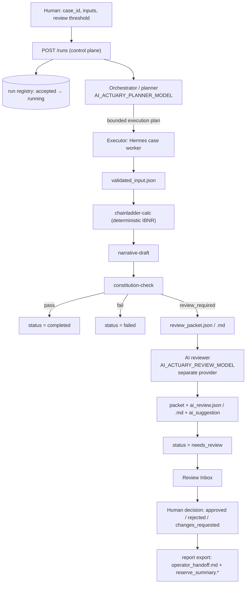
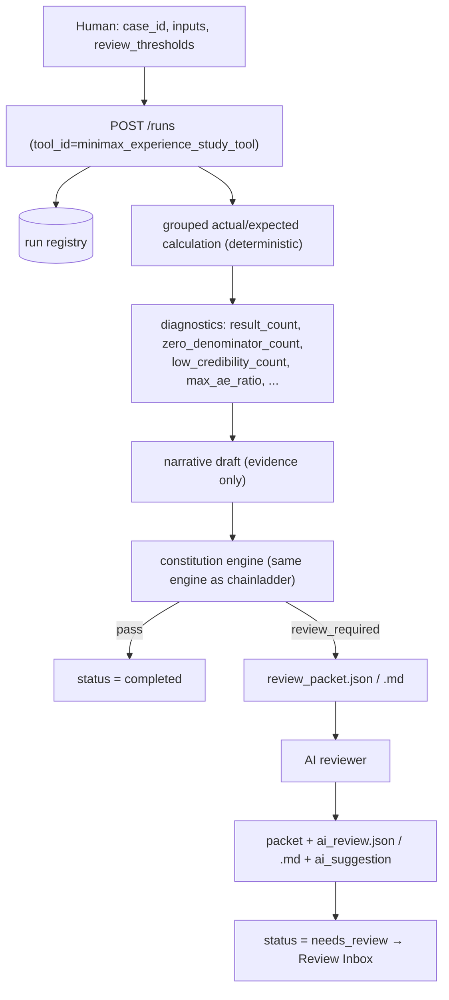

# AI Actuary Operations Manual

How the workbench actually runs: who does what, how the two independent
calculations produce results, what is handed over at every step, where review
packets come from, and how to configure the reviewer model.
[中文版](operations-manual.zh-CN.md)

---

## 1. The model in one page

| Role | Component | Calls a model? | Owns |
| --- | --- | --- | --- |
| Human actuary | Operator Console | — | case choice, thresholds, approval / rejection |
| Orchestrator (planner) | `workflows/agent-runtimes/openai-agents/` | Yes | route selection, bounded execution plan, final governed assembly |
| Executor (Hermes worker) | `workflows/agent-runtimes/hermes-worker/` | No by default — one optional narrative slot | run the tool chain, package artifacts, build the review packet |
| Deterministic core | `src/reserving_workflow/calculators`, `constitution/` | No | numbers and governance rules |
| Reviewer (AI review) | `src/reserving_workflow/review/ai_reviewer.py` | Yes, only when `needs_review` | advisory focus points for the human reviewer |

Hard boundary: **numbers come only from the deterministic core.** The planner
chooses a route, the executor packages evidence, the reviewer comments, and the
human decides. The AI reviewer cannot change a number, and a failed reviewer
call never changes a run status.

---

## 2. Install and start

```bash
python -m venv .venv && . .venv/bin/activate
pip install -e '.[dev]'
Copy-Item .env.sample .env        # PowerShell (or: cp .env.sample .env)
python scripts/run_local_workbench.py
```

- Operator Console / API: `http://127.0.0.1:8000/console`
- ADK Developer Web (optional): `http://127.0.0.1:8001` — see the [ADK manual](adk-operations-manual.md)
- Ports: `--api-port 8123 --adk-port 8124`; skip ADK with `--disable-adk`

The console starts locked. Choose **Request launcher handoff**, then paste the
handoff ID shown in the browser into the launcher terminal. The ID is not a
credential. Programmatic clients must implement the body-bootstrap session,
CSRF, Host, and Origin contract (ADR 0003).

---

## 3. Configuration reference

Planner and reviewer are configured **independently**: one run can plan with
`gpt-5.6-luna` and review with `deepseek-flash`.

| Variable | Role | Default in `.env.sample` | Restart? |
| --- | --- | --- | --- |
| `OPENAI_API_KEY` | planner credential; reviewer fallback | — | yes |
| `OPENAI_BASE_URL` | gateway for the OpenAI SDK; **keep commented when unused** | commented | yes |
| `DEEPSEEK_API_KEY` | DeepSeek reviewer key and ADK litellm routing | — | no (reviewer) |
| `GOOGLE_API_KEY` | ADK Gemini models | — | yes |
| `AI_ACTUARY_PLANNER_MODEL` | **planning** model | `gpt-5.6-luna` | **yes** (read at import) |
| `AI_ACTUARY_REVIEW_MODEL` | **review** model | `deepseek-flash` | no (read per call) |
| `AI_ACTUARY_REVIEW_BASE_URL` | review endpoint (any OpenAI-compatible API) | `https://api.deepseek.com/v1` | no |
| `AI_ACTUARY_REVIEW_API_KEY` | review key; falls back to `DEEPSEEK_API_KEY` when the model/endpoint points at DeepSeek, else `OPENAI_API_KEY` | unset | no |
| `AI_ACTUARY_AI_REVIEW_ENABLED` | `0` keeps packets purely deterministic | `1` | no |
| `AI_ACTUARY_REVIEW_MAX_TOKENS` | reviewer output budget | `4000` | no |
| `AI_ACTUARY_REVIEW_TIMEOUT_SECONDS` | per-call timeout | `60` | no |
| `AI_ACTUARY_ADK_MODEL` | ADK chat model (`deepseek/` prefix → litellm) | `gpt-5.6-luna` | yes |
| `AI_ACTUARY_NARRATIVE_ENABLED` | `1` lets a model rewrite narrative **wording** only; `0` restores the template | `1` (enabled) | no |
| `AI_ACTUARY_NARRATIVE_MODEL` | narrative model id, any OpenAI-compatible provider | `gpt-5.6-luna` | no |
| `AI_ACTUARY_NARRATIVE_BASE_URL` | narrative endpoint (e.g. `https://api.deepseek.com/v1`) | falls back to `OPENAI_BASE_URL` | no |
| `AI_ACTUARY_NARRATIVE_API_KEY` | narrative key; falls back to `DEEPSEEK_API_KEY` / `OPENAI_API_KEY` | unset | no |
| `AI_ACTUARY_NARRATIVE_MAX_TOKENS` | narrative output budget | `1200` | no |
| `AI_ACTUARY_NARRATIVE_TIMEOUT_SECONDS` | per-call timeout | `60` | no |
| `AI_ACTUARY_OPERATOR_*` | console capability credentials and TTLs | generated by launcher | yes |
| `AI_ACTUARY_CONTROL_PLANE_URL`, `AI_ACTUARY_ADK_URL` | loopback URLs | `127.0.0.1:8000/8001` | yes |

Switch the reviewer provider by editing three lines — no restart needed:

```bash
# DeepSeek (default in this repo)
AI_ACTUARY_REVIEW_MODEL=deepseek-flash
AI_ACTUARY_REVIEW_BASE_URL=https://api.deepseek.com/v1

# OpenAI instead
# AI_ACTUARY_REVIEW_MODEL=gpt-5.6-luna
# AI_ACTUARY_REVIEW_BASE_URL=
```

The executor needs no model configuration at all: Hermes workers are
deterministic and only call actuarial tools.

---

## 4. The two independent calculations

| | A. Reserving — Chainladder | B. Experience study — grouped actual/expected |
| --- | --- | --- |
| Entry | `POST /runs` with `tool_id=chainladder`, or `scripts/run_governed_case.py` | `POST /runs` with `tool_id=minimax_experience_study_tool` |
| Goes through the planner | Yes (OpenAI planner picks the route) | No (registered tool runner, executed directly) |
| Input | triangle rows / bundled sample (`RAA`) | policy rows or bundled sample (`ae_small`), grouping dimensions |
| Calculation | development factors → projected ultimate → IBNR (`chainladder-python`) | grouped sums of actual vs expected counts/amounts, Poisson exact interval, credibility flag |
| Numbers written | `deterministic_result.json` (IBNR + `diagnostics`) | `deterministic_result.json` (grouped results + `diagnostics`) |
| Review trigger | `origin_count > review_threshold_origin_count` | diagnostics vs thresholds (see §6) |
| Governance | same `constitution/engine.py` for both | same |

Both paths write the same artifact contract, so review, export, replay, and
rerun behave identically afterwards.

### 4.1 Chainladder path



### 4.2 Experience study path



---

## 5. Step-by-step handoff

| # | Producer | Output (artifact / payload) | Consumer |
| --- | --- | --- | --- |
| 1 | Human via Console or API | `RunCreateRequest`: `case_id`, `tool_id`, `inputs`, `review_threshold_origin_count` or `review_thresholds` | control plane |
| 2 | Control plane | `run_id`, registry event `accepted` → `running` | worker / console polling |
| 3 | Orchestrator (planner) | bounded `AgentExecutionPlan` (chainladder path only) | Hermes worker |
| 4 | Executor (worker) | `validated_input.json` | deterministic calculators |
| 5 | Deterministic core | `deterministic_result.json` — numbers + `diagnostics` | narrative draft, constitution check |
| 6 | narrative-draft | `narrative_draft.json` (evidence only, no invented numbers; wording may come from the optional narrative model) | constitution check, review packet |
| 7 | constitution-check | `constitution_check.json`: `pass` / `review_required` / `fail` + reasons | run status, review generator |
| 8 | review generator | `review_packet.json` + `review_packet.md` | AI reviewer and human reviewer |
| 9 | AI reviewer (advisory) | `ai_review.json` + `ai_review.md`, and `ai_review` / `ai_suggestion` written back into the packet | console "AI guidance" block |
| 10 | Human actuary | `review_decision.json` + `review_decision.md` | report export |
| 11 | report export | `operator_handoff.md`, `reserve_summary.json`, `reserve_summary.md` | downstream business use |
| — | `run_manifest.json` | run-level index of every artifact above | audit, replay, rerun |

---

## 6. How review is produced

`src/reserving_workflow/constitution/engine.py` returns exactly one of:

```text
pass            -> run status completed
review_required -> run status needs_review (+ review packet)
fail            -> run status failed (hard constraint breached)
```

Triggers are numeric and deterministic:

- `diagnostics[metric] > threshold` for any metric named in `review_thresholds`
- required artifacts missing
- hard constraints (for example: no usable input) — these fail the run instead

**Chainladder**: set `review_threshold_origin_count` in the console or
`--review-threshold-origin-count 5` on the CLI. RAA has `origin_count = 10`, so
any threshold below 10 triggers review.

**Experience study**: computed diagnostics are

```text
row_count, group_count, result_count,
zero_denominator_count, low_credibility_count,
max_ae_ratio, min_ae_ratio,
actual_claim_count_total, expected_claim_count_total
```

Default thresholds: `{zero_denominator_count: 0, low_credibility_count: 0, max_ae_ratio: 5}`.
A zero threshold means "any occurrence escalates". Override per run:

```jsonc
// POST /runs
{
  "case_id": "ae-case",
  "tool_id": "minimax_experience_study_tool",
  "inputs": { "sample_name": "ae_small", "dimensions": ["product"] },
  "review_thresholds": { "zero_denominator_count": 10, "low_credibility_count": 100, "max_ae_ratio": 10 }
}
```

The console shows the same field for non-chainladder tools. Reason codes appear
in `constitution_check.json` as
`diagnostic_threshold:<metric>:value=<v>:threshold=<t>`.

---

## 7. Where the AI reviewer comes from

The reviewer is a separate, provider-agnostic model call that runs **only after
a deterministic review packet exists**.

1. Executor writes `review_packet.json` / `review_packet.md`.
2. `review/ai_reviewer.py` reads the packet (status, failed checks, review
   reasons, diagnostics, a short results excerpt, draft narrative).
3. The model returns JSON: `summary`, `focus_points[{title, severity, rationale, evidence}]`,
   `suggested_actions`.
4. Results are written as `ai_review.json` + `ai_review.md` and mirrored into the
   packet as `ai_review` and `ai_suggestion`, which the console renders as
   **AI guidance**.

Contract rules enforced by the prompt:

- never recompute, correct, or invent numbers — quote only values present in the packet
- say so when the evidence is thin
- focus on risk, data quality, methodology fit, and what a human must verify
- English unless the packet content is Chinese

Failure behaviour (never blocks a run):

| Situation | Recorded as |
| --- | --- |
| no API key | `status=failed`, `error=missing_api_key` |
| model unreachable / timeout | `status=failed`, `error=<exception chain>` |
| model returns empty JSON | retried once, then `status=failed`, `error=empty_model_response` |
| `AI_ACTUARY_AI_REVIEW_ENABLED=0` | `status=skipped` |

Run status, numbers, and artifacts are untouched in every case.

---

## 8. Optional model-backed narrative drafting (executor side)

The slot is **on by default** (`AI_ACTUARY_NARRATIVE_ENABLED=1`): every run asks
a model — the fourth model slot — to rewrite the *wording* of the summary and
key points in `narrative_draft.json`. Numbers still come from the deterministic
core, so only the prose is model-generated. Set
`AI_ACTUARY_NARRATIVE_ENABLED=0` (or use `--narrative-model off` for one run) to
build `narrative_draft.json` from the template again, with no model call.

What the guardrails guarantee:

- `cited_values` are always copied from the deterministic result — the model
  cannot add, drop, or change a number.
- Every number in the generated text must appear in the run evidence
  (`reserve_summary` + `diagnostics`). Quoting with fewer decimals is fine; a
  number that is not traceable is rejected.
- The model receives only evidence (case id, method, summary, diagnostics) and
  is told not to compute, round, or invent anything, and not to recommend a decision.
- Strict JSON output; empty responses are retried once.

Any failure falls back to the template silently, and the drafting source is
recorded:

| Situation | Result |
| --- | --- |
| slot disabled (`AI_ACTUARY_NARRATIVE_ENABLED=0`) | template, `reason=disabled` |
| no API key | template, `reason=missing_api_key` |
| model unreachable / timeout / bad JSON | template, `reason=model_error` |
| model invents a number | template, `reason=numeric_guard_rejected` |
| everything checks out | model wording, `source=model` |

Where to see it: the CLI prints `narrative_source` / `narrative_model`, the
worker reports them in `worker_metadata`, and experience-study runs annotate
`narrative_source` / `narrative_model` directly in `narrative_draft.json`.

```bash
# draft with DeepSeek while the planner keeps using gpt-5.6-luna
AI_ACTUARY_NARRATIVE_ENABLED=1
AI_ACTUARY_NARRATIVE_MODEL=deepseek-flash
AI_ACTUARY_NARRATIVE_BASE_URL=https://api.deepseek.com/v1

# template wording only, no model call:
# AI_ACTUARY_NARRATIVE_ENABLED=0
```

Per-run override in the CLI: `--narrative-model auto|on|off`.

---

## 9. Operating procedures

### Console

1. Start the workbench and unlock the console (handoff).
2. **Create Governed Run**: choose `case_id`, tool (`chainladder` or
   `minimax_experience_study_tool`), inputs, and a review threshold.
3. Follow the run in **Run Queue** → Timeline / Results / Artifacts.
4. If the run is `needs_review`, open **Review Inbox**, read the review packet and
   **AI guidance**, then submit `approved` / `rejected` / `changes_requested`.
5. **Export handoff report** for an eligible completed run.

### CLI

```bash
python scripts/run_governed_case.py --case-id demo-case \
  --artifact-dir ./tmp/demo-case --registry-path ./tmp/run-registry.json

python scripts/run_governed_case.py --case-id review-case \
  --artifact-dir ./tmp/review-case --registry-path ./tmp/run-registry.json \
  --review-threshold-origin-count 5

python scripts/list_runs.py --registry-path ./tmp/run-registry.json
python scripts/rerun_case.py --registry-path ./tmp/run-registry.json --run-id <run_id> --artifact-dir ./tmp/rerun-case
python scripts/export_run_report.py --registry-path ./tmp/run-registry.json --run-id <run_id> --review-store-dir ./tmp/reviews
```

A rerun always creates a new `run_id` and a new artifact directory; the source
run is preserved.

---

## 10. Troubleshooting

| Symptom | Cause / fix |
| --- | --- |
| AI review `missing_api_key` | set `AI_ACTUARY_REVIEW_API_KEY`, or `DEEPSEEK_API_KEY` when using DeepSeek, or `OPENAI_API_KEY` |
| AI review `empty_model_response` | raise `AI_ACTUARY_REVIEW_MAX_TOKENS` (reasoning models think in completion tokens) or disable with `AI_ACTUARY_AI_REVIEW_ENABLED=0` |
| Run stays `completed` although review was expected | threshold not exceeded; inspect `deterministic_result.json` → `diagnostics` |
| Experience study always escalates | default `zero_denominator_count`/`low_credibility_count` thresholds are `0`; pass explicit `review_thresholds` |
| Planner fails with `planner_runtime` / missing protocol | an active empty `OPENAI_BASE_URL=` breaks the SDK — keep it commented |
| Console locked | complete the launcher handoff, or set `AI_ACTUARY_OPERATOR_BOOTSTRAP_TOKEN` before starting |
| Port conflict | launcher refuses occupied ports; use `--api-port` / `--adk-port` |

---

## 11. Glossary

| Term | Meaning |
| --- | --- |
| Orchestrator / planner | model-backed router that turns a request into a bounded execution plan |
| Executor / Hermes worker | deterministic execution and artifact packaging boundary |
| Constitution engine | the rule engine deciding `pass` / `review_required` / `fail` |
| Review packet | deterministic evidence bundle handed to a human reviewer |
| AI review | advisory model output attached to a review packet; cannot change numbers |
| Narrative slot | optional model that rewrites narrative wording only, guarded by evidence numbers |
| Registry | operational index of runs; artifacts remain the audit evidence |
| Handoff report | evidence-only export (`operator_handoff.md`, `reserve_summary.*`) |

## Related documents

- [Architecture](architecture.md) · [Control-plane contract](contracts/control-plane.md)
- [ADK Operations Manual](adk-operations-manual.md) · [ADK local workbench](adk-local-workbench.md)
- [Operator handoff contract](operator_handoff.md)
