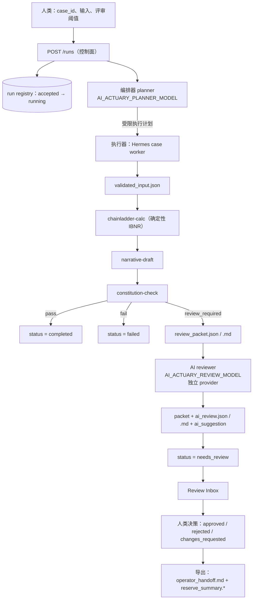
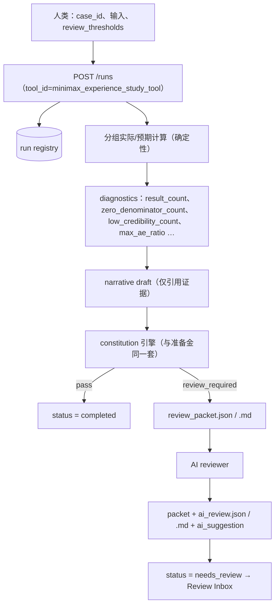

# AI Actuary 操作手册（中文）

本手册讲清楚：系统怎么跑、每个角色做什么、两条独立计算分别是怎么算并产出结果的、每一步交接什么、review 是怎么产生的、reviewer（AI 审阅）是怎么来的、以及怎么配置。
[English](operations-manual.md)

---

## 1. 一页看懂角色分工

| 角色                             | 组件                                                      | 是否调用模型                             | 负责什么                                   |
| -------------------------------- | --------------------------------------------------------- | ---------------------------------------- | ------------------------------------------ |
| 人类精算师                       | Operator Console                                          | —                                       | 选案例、定阈值、批准/拒绝/要求修改         |
| 编排器 Orchestrator（planner）   | `workflows/agent-runtimes/openai-agents/`               | 会                                       | 选择路由、产出受限执行计划、汇总受治理输出 |
| 执行器 Executor（Hermes worker） | `workflows/agent-runtimes/hermes-worker/`               | 默认不会（可选叙述模型位）                                     | 跑工具链、打包产物、生成 review packet     |
| 确定性核心                       | `src/reserving_workflow/calculators`、`constitution/` | 不会                                     | 算数与治理规则                             |
| 审阅器 Reviewer（AI review）     | `src/reserving_workflow/review/ai_reviewer.py`          | 会，且**只在 `needs_review` 时** | 给人类提示该关注什么                       |

硬性边界：**数字只来自确定性核心。** planner 负责选路，executor 负责执行与打包，reviewer 只发表意见，最终决策归人类。AI reviewer 不能改动任何数字；调用失败也不会改变 run 状态。

---

## 2. 安装与启动

```bash
python -m venv .venv && . .venv/bin/activate
pip install -e '.[dev]'
Copy-Item .env.sample .env        # PowerShell（或 cp .env.sample .env）
python scripts/run_local_workbench.py
```

- Operator Console / API：`http://127.0.0.1:8000/console`
- ADK Developer Web（可选）：`http://127.0.0.1:8001`，详见 [ADK 手册](adk-operations-manual.zh-CN.md)
- 换端口：`--api-port 8123 --adk-port 8124`；不启 ADK：`--disable-adk`

控制台首次打开是锁定状态：点 **Request launcher handoff**，把浏览器里显示的 handoff ID 粘回启动器终端即可解锁（ID 不是凭证）。程序化调用需要实现 body-bootstrap 会话、CSRF、Host、Origin 契约（ADR 0003）。

---

## 3. 配置参考

planner 与 reviewer **彼此独立**：同一次 run 可以用 `gpt-5.6-luna` 做规划、用 `deepseek-flash` 做审阅。

| 变量                                                     | 作用                                                                                                 | `.env.sample` 默认值          | 是否需重启                      |
| -------------------------------------------------------- | ---------------------------------------------------------------------------------------------------- | ------------------------------- | ------------------------------- |
| `OPENAI_API_KEY`                                       | planner 凭证；reviewer 的兜底 key                                                                    | —                              | 需要                            |
| `OPENAI_BASE_URL`                                      | OpenAI SDK 网关；**不用时保持注释**                                                            | 已注释                          | 需要                            |
| `DEEPSEEK_API_KEY`                                     | DeepSeek reviewer 与 ADK litellm 路由                                                                | —                              | 不需要（reviewer）              |
| `GOOGLE_API_KEY`                                       | ADK 使用 Gemini 模型                                                                                 | —                              | 需要                            |
| `AI_ACTUARY_PLANNER_MODEL`                             | **规划**模型                                                                                   | `gpt-5.6-luna`                | **需要**（import 时读取） |
| `AI_ACTUARY_REVIEW_MODEL`                              | **审阅**模型                                                                                   | `deepseek-flash`               | 不需要（每次调用读取）          |
| `AI_ACTUARY_REVIEW_BASE_URL`                           | 审阅端点（任意 OpenAI 兼容 API）                                                                     | `https://api.deepseek.com/v1` | 不需要                          |
| `AI_ACTUARY_REVIEW_API_KEY`                            | 审阅 key；未设置时，若模型/端点指向 DeepSeek 则自动用`DEEPSEEK_API_KEY`，否则用 `OPENAI_API_KEY` | 未设置                          | 不需要                          |
| `AI_ACTUARY_AI_REVIEW_ENABLED`                         | 置`0` 则完全确定性，不调模型                                                                       | `1`                           | 不需要                          |
| `AI_ACTUARY_REVIEW_MAX_TOKENS`                         | 审阅输出预算                                                                                         | `4000`                        | 不需要                          |
| `AI_ACTUARY_REVIEW_TIMEOUT_SECONDS`                    | 单次调用超时                                                                                         | `60`                          | 不需要                          |
| `AI_ACTUARY_ADK_MODEL`                                 | ADK 聊天模型（`deepseek/` 前缀走 litellm）                                                         | `gpt-5.6-luna`                | 需要                            |
| `AI_ACTUARY_NARRATIVE_ENABLED`                        | 置 `1` 时允许模型改写叙述**措辞**；置 `0` 回到模板                                              | `1`（默认开启）               | 不需要                          |
| `AI_ACTUARY_NARRATIVE_MODEL`                          | 叙述模型 id，任意 OpenAI 兼容 provider                                                            | `gpt-5.6-luna`                | 不需要                          |
| `AI_ACTUARY_NARRATIVE_BASE_URL`                       | 叙述端点（如 `https://api.deepseek.com/v1`）                                                      | 回退 `OPENAI_BASE_URL`        | 不需要                          |
| `AI_ACTUARY_NARRATIVE_API_KEY`                        | 叙述 key；回退 `DEEPSEEK_API_KEY` / `OPENAI_API_KEY`                                              | 未设置                        | 不需要                          |
| `AI_ACTUARY_NARRATIVE_MAX_TOKENS`                     | 叙述输出预算                                                                                     | `1200`                        | 不需要                          |
| `AI_ACTUARY_NARRATIVE_TIMEOUT_SECONDS`                | 单次调用超时                                                                                     | `60`                          | 不需要                          |
| `AI_ACTUARY_OPERATOR_*`                                | 控制台能力凭证与 TTL                                                                                 | 启动器自动生成                  | 需要                            |
| `AI_ACTUARY_CONTROL_PLANE_URL`、`AI_ACTUARY_ADK_URL` | 回环地址                                                                                             | `127.0.0.1:8000/8001`         | 需要                            |

换 reviewer 只需改三行，**无需重启**：

```bash
# DeepSeek（本仓库默认）
AI_ACTUARY_REVIEW_MODEL=deepseek-flash
AI_ACTUARY_REVIEW_BASE_URL=https://api.deepseek.com/v1

# 换成 OpenAI
# AI_ACTUARY_REVIEW_MODEL=gpt-5.6-luna
# AI_ACTUARY_REVIEW_BASE_URL=
```

执行器不需要任何模型配置：Hermes worker 是确定性的，只调精算工具。

---

## 4. 两条独立计算

|                  | A. 准备金：Chainladder                                                       | B. 经验研究：分组实际/预期（A/E）                                     |
| ---------------- | ---------------------------------------------------------------------------- | --------------------------------------------------------------------- |
| 入口             | `POST /runs`，`tool_id=chainladder`；或 `scripts/run_governed_case.py` | `POST /runs`，`tool_id=minimax_experience_study_tool`             |
| 是否经过 planner | 是（planner 决定路由）                                                       | 否（已注册的工具 runner 直接执行）                                    |
| 输入             | 三角数据或内置样本（`RAA`）                                                | 保单行或内置样本（`ae_small`）+ 分组维度                            |
| 算法             | 进展因子 → 终极赔款 → IBNR（`chainladder-python`）                       | 分组 actual/expected 汇总（计数与金额）、Poisson 精确区间、可信度标记 |
| 数字产物         | `deterministic_result.json`（IBNR + `diagnostics`）                      | `deterministic_result.json`（分组结果 + `diagnostics`）           |
| 评审触发         | `origin_count > review_threshold_origin_count`                             | 诊断指标 vs 阈值（见第 6 节）                                         |
| 治理             | 两条链路共用同一个`constitution/engine.py`                                 | 同左                                                                  |

两条链路写同一套产物契约，所以后续的评审、导出、复算、重跑行为完全一致。

### 4.1 Chainladder 链路



### 4.2 经验研究链路



---

## 5. 每一步交接什么

| #  | 产出方                | 产物 / 载荷                                                                                                            | 接收方                              |
| -- | --------------------- | ---------------------------------------------------------------------------------------------------------------------- | ----------------------------------- |
| 1  | 人类（控制台或 API）  | `RunCreateRequest`：`case_id`、`tool_id`、`inputs`、`review_threshold_origin_count` 或 `review_thresholds` | 控制面                              |
| 2  | 控制面                | `run_id`，registry 事件 `accepted` → `running`                                                                  | worker / 控制台轮询                 |
| 3  | 编排器 planner        | 受限`AgentExecutionPlan`（仅 Chainladder 链路）                                                                      | Hermes worker                       |
| 4  | 执行器 worker         | `validated_input.json`                                                                                               | 确定性计算器                        |
| 5  | 确定性核心            | `deterministic_result.json`：数字 + `diagnostics`                                                                  | narrative draft、constitution check |
| 6  | narrative-draft       | `narrative_draft.json`（只引用证据、不编造数字；措辞可来自可选叙述模型）                                                                     | constitution check、review packet   |
| 7  | constitution-check    | `constitution_check.json`：`pass` / `review_required` / `fail` + 原因                                          | run 状态、review generator          |
| 8  | review generator      | `review_packet.json` + `review_packet.md`                                                                          | AI reviewer 与人类审阅人            |
| 9  | AI reviewer（建议性） | `ai_review.json` + `ai_review.md`，并把 `ai_review` / `ai_suggestion` 回写进 packet                            | 控制台 "AI guidance" 区块           |
| 10 | 人类精算师            | `review_decision.json` + `review_decision.md`                                                                      | 报告导出                            |
| 11 | 报告导出              | `operator_handoff.md`、`reserve_summary.json`、`reserve_summary.md`                                              | 下游业务使用                        |
| — | `run_manifest.json` | 上述全部产物的 run 级索引                                                                                              | 审计、复算、重跑                    |

---

## 6. review 是怎么产生的

`src/reserving_workflow/constitution/engine.py` 只返回三种状态之一：

```text
pass            -> run 状态 completed
review_required -> run 状态 needs_review（并生成 review packet）
fail            -> run 状态 failed（硬性约束被破坏）
```

触发条件完全是数值化、确定性的：

- `review_thresholds` 中任一指标满足 `diagnostics[metric] > threshold`
- 必需产物缺失
- 硬性约束（例如没有可用输入）——这种情况直接 failed，而不是进评审

**Chainladder**：控制台填 `review_threshold_origin_count`，或 CLI 传 `--review-threshold-origin-count 5`。RAA 的 `origin_count = 10`，所以阈值低于 10 就会触发。

**经验研究**：先算出诊断指标

```text
row_count、group_count、result_count、
zero_denominator_count、low_credibility_count、
max_ae_ratio、min_ae_ratio、
actual_claim_count_total、expected_claim_count_total
```

默认阈值：`{zero_denominator_count: 0, low_credibility_count: 0, max_ae_ratio: 5}`；阈值 0 表示"出现一次就升级"。可按 run 覆盖：

```jsonc
// POST /runs
{
  "case_id": "ae-case",
  "tool_id": "minimax_experience_study_tool",
  "inputs": { "sample_name": "ae_small", "dimensions": ["product"] },
  "review_thresholds": { "zero_denominator_count": 10, "low_credibility_count": 100, "max_ae_ratio": 10 }
}
```

控制台对非 chainladder 工具显示同一个输入框。触发原因写在 `constitution_check.json` 里，形如
`diagnostic_threshold:<指标>:value=<值>:threshold=<阈值>`。

---

## 7. reviewer（AI 审阅）是怎么来的

reviewer 是一次**独立的、与 provider 无关的模型调用**，而且只在确定性 review packet 已经生成之后才发生。

1. 执行器写出 `review_packet.json` / `review_packet.md`。
2. `review/ai_reviewer.py` 读取包内信息：状态、失败检查、触发原因、诊断指标、少量结果摘录、叙述草稿。
3. 模型只返回 JSON：`summary`、`focus_points[{title, severity, rationale, evidence}]`、`suggested_actions`。
4. 结果写成 `ai_review.json` + `ai_review.md`，同时以 `ai_review` 与 `ai_suggestion` 回写进 packet，控制台渲染为 **AI guidance**。

提示词里的硬约束：

- 不得重算、修正或编造数字，只能引用包里已有的值
- 证据不足时明确说明，而不是猜测
- 关注风险、数据质量、方法适用性，以及签字前人类必须核实什么
- 默认英文；若包内内容是中文则用中文

失败行为（**绝不阻断 run**）：

| 情况                               | 记录为                                                                |
| ---------------------------------- | --------------------------------------------------------------------- |
| 没有 API key                       | `status=failed`，`error=missing_api_key`                          |
| 模型不可达 / 超时                  | `status=failed`，`error=<异常链>`                                 |
| 模型返回空 JSON                    | 自动重试一次，仍空则`status=failed`，`error=empty_model_response` |
| `AI_ACTUARY_AI_REVIEW_ENABLED=0` | `status=skipped`                                                    |

以上任何一种情况，run 状态、数字与产物都不受影响。

---

## 8. 可选模型位：执行器侧叙述生成

**该模型位默认开启**（`AI_ACTUARY_NARRATIVE_ENABLED=1`）：每次 run 都会调用模型——即第四个模型位——改写 summary 与 key points 的**措辞**。数字永远来自确定性核心，模型只负责行文。设 `AI_ACTUARY_NARRATIVE_ENABLED=0`（或单次运行用 `--narrative-model off`）即可回到纯模板，完全不调用模型。

护栏保证：

- `cited_values` 永远从确定性结果拷贝，模型不能增删或改动任何数字；
- 生成文本里的每个数字都必须出现在 run 证据（`reserve_summary` + `diagnostics`）里；少写几位小数可以，凭空出现的数字直接判否；
- 模型只收到证据（case id、方法、汇总、诊断），并被要求不得计算、四舍五入或编造，也不得替人类下结论；
- 严格 JSON 输出；空响应自动重试一次。

任何异常都会静默回退到模板，并记录来源：

| 情况 | 结果 |
| --- | --- |
| 槽位关闭（`AI_ACTUARY_NARRATIVE_ENABLED=0`） | 模板，`reason=disabled` |
| 没有 API key | 模板，`reason=missing_api_key` |
| 模型不可达 / 超时 / 返回非法 JSON | 模板，`reason=model_error` |
| 模型写出了证据里没有的数字 | 模板，`reason=numeric_guard_rejected` |
| 全部校验通过 | 模型措辞，`source=model` |

在哪里能看到：CLI 会打印 `narrative_source` / `narrative_model`，worker 把它们写进 `worker_metadata`，经验研究 run 则直接把这两个字段写进 `narrative_draft.json`。

```bash
# 用 DeepSeek 写叙述，同时 planner 继续用 gpt-5.6-luna
AI_ACTUARY_NARRATIVE_ENABLED=1
AI_ACTUARY_NARRATIVE_MODEL=deepseek-flash
AI_ACTUARY_NARRATIVE_BASE_URL=https://api.deepseek.com/v1

# 只用模板、完全不调模型：
# AI_ACTUARY_NARRATIVE_ENABLED=0
```

单次运行覆盖：CLI 用 `--narrative-model auto|on|off`。

---

## 9. 操作步骤

### 控制台

1. 启动工作台并完成握手解锁。
2. **Create Governed Run**：填 `case_id`、选择工具（`chainladder` 或 `minimax_experience_study_tool`）、输入与评审阈值。
3. 在 **Run Queue** 里跟踪 Timeline / Results / Artifacts。
4. 若 run 为 `needs_review`：打开 **Review Inbox**，阅读 review packet 与 **AI guidance**，提交 `approved` / `rejected` / `changes_requested`。
5. 对符合条件的已完成 run，点 **Export handoff report**。

### 命令行

```bash
python scripts/run_governed_case.py --case-id demo-case \
  --artifact-dir ./tmp/demo-case --registry-path ./tmp/run-registry.json

python scripts/run_governed_case.py --case-id review-case \
  --artifact-dir ./tmp/review-case --registry-path ./tmp/run-registry.json \
  --review-threshold-origin-count 5

python scripts/list_runs.py --registry-path ./tmp/run-registry.json
python scripts/rerun_case.py --registry-path ./tmp/run-registry.json --run-id <run_id> --artifact-dir ./tmp/rerun-case
python scripts/export_run_report.py --registry-path ./tmp/run-registry.json --run-id <run_id> --review-store-dir ./tmp/reviews
```

重跑（rerun）一定会生成新的 `run_id` 和新的产物目录，原 run 保持不变。

---

## 10. 排障

| 现象                                   | 原因 / 处理                                                                                                       |
| -------------------------------------- | ----------------------------------------------------------------------------------------------------------------- |
| AI review 报`missing_api_key`        | 设置`AI_ACTUARY_REVIEW_API_KEY`；用 DeepSeek 时也可只设 `DEEPSEEK_API_KEY`；否则设 `OPENAI_API_KEY`         |
| AI review 报`empty_model_response`   | 调大`AI_ACTUARY_REVIEW_MAX_TOKENS`（推理模型把 token 用在思考上），或用 `AI_ACTUARY_AI_REVIEW_ENABLED=0` 关闭 |
| run 仍是`completed`，没进评审        | 阈值未突破；检查`deterministic_result.json` → `diagnostics`                                                  |
| 经验研究每次都进评审                   | 默认`zero_denominator_count` / `low_credibility_count` 阈值是 `0`；显式传 `review_thresholds`             |
| planner 报`planner_runtime` / 缺协议 | 生效的空`OPENAI_BASE_URL=` 会让 SDK 请求 URL 缺协议 —— 保持注释                                               |
| 控制台锁定                             | 完成启动器握手，或启动前设置`AI_ACTUARY_OPERATOR_BOOTSTRAP_TOKEN`                                               |
| 端口冲突                               | 启动器会拒绝占用中的端口；用`--api-port` / `--adk-port` 换端口                                                |

---

## 11. 术语表

| 术语                   | 含义                                                               |
| ---------------------- | ------------------------------------------------------------------ |
| 编排器 / planner       | 由模型驱动的路由者，把请求转成受限执行计划                         |
| 执行器 / Hermes worker | 确定性执行与产物打包边界                                           |
| Constitution 引擎      | 判定`pass` / `review_required` / `fail` 的规则引擎           |
| Review packet          | 交给人类审阅人的确定性证据包                                       |
| AI review              | 附加在 review packet 上的建议性模型输出，不能改数字                |
| 叙述模型位             | 可选模型，只改写叙述措辞，并受证据数字护栏约束                      |
| Registry               | run 的运行索引；产物才是审计证据                                   |
| 交接报告               | 仅基于证据的导出（`operator_handoff.md`、`reserve_summary.*`） |

## 相关文档

- [架构说明](architecture.md) · [控制面契约](contracts/control-plane.md)
- [ADK 操作手册（中文）](adk-operations-manual.zh-CN.md) · [ADK 本地工作台](adk-local-workbench.md)
- [交接报告契约](operator_handoff.md)
