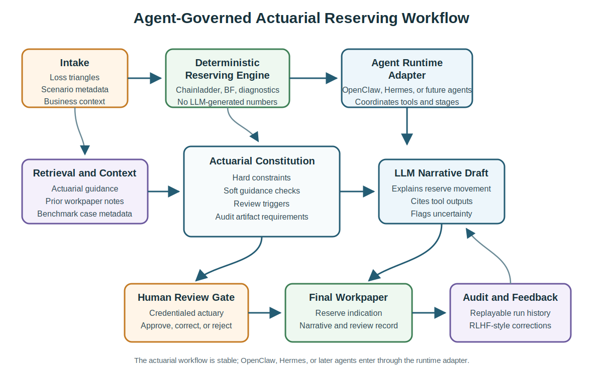
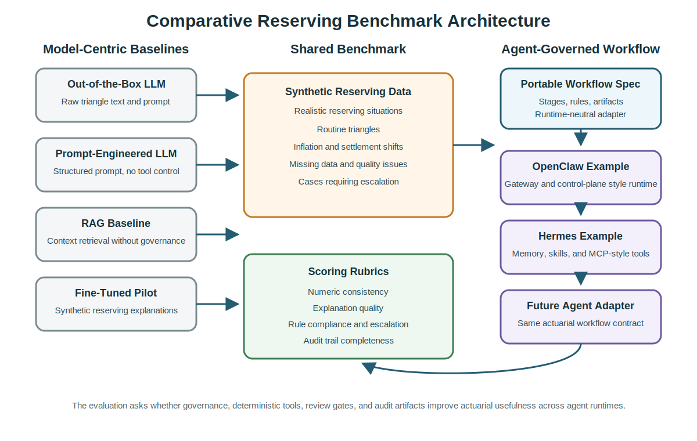

# **CAS Research Proposal: Agent Governed Constitutional AI for Specialized P&C Reserving Workflows**

## **Adapting Large Language Models to Loss Reserving with Portable Agent Governance, Deterministic Actuarial Tools, and Actuary Driven Feedback**

**Principal Investigator:** Jiangang He, FSA, FCIA, FCAA

**Submission Date:** Monday, April 27, 2026

**Budget Requested:** $79,000

**Project Duration:** June 12, 2026 to October 2, 2026

## **Executive Summary**

This proposal responds to the Casualty Actuarial Society 2026 Request for Proposals on adapting large language models (LLMs) to specialized P&C actuarial work. The central premise is simple: for deterministic actuarial tasks, an LLM should not be asked to generate the core numbers on its own. It should operate inside a governed actuarial workflow where calculations, controls, review gates, and audit records are explicit.

The project focuses on **reserving and loss development analysis**. Reserving is a strong test case because it combines strict numerical discipline with substantial actuarial explanation and judgment. The system must calculate reserve indications through established deterministic methods, such as Chainladder and Bornhuetter-Ferguson, while also explaining why certain link ratios were selected or excluded, why development patterns are changing, and when an actuary should review the result before it is finalized.

The agent landscape is evolving quickly. Newer systems such as Hermes show that practical actuarial AI research should look beyond any single platform and ask how governance can remain stable as agent runtimes change. This proposal treats OpenClaw, Hermes, and future agent frameworks as examples of a more general **agent governed actuarial workflow**. The research contribution is not to prove that one agent product is best. It is to define, implement, and evaluate a portable governance pattern that can be run through different agent runtimes while preserving deterministic actuarial calculations, constitutional checks, human review, and replayable audit trails.

In the proposed architecture, the deterministic reserving engine remains outside the LLM. We will use open source actuarial tooling, including the CAS chainladder Python package where appropriate, to perform numeric reserving calculations. The agent layer coordinates workflow execution: intake, data validation, calculation calls, retrieval of relevant context, constitutional checking, narrative generation, human review routing, and run logging. OpenClaw and Hermes will be used as example runtimes because they represent two important directions in current agent design: OpenClaw as a local first gateway and control plane style agent, and Hermes as an agent oriented around memory and reusable skills. The workflow specification will be designed so that future agent frameworks can be swapped in through an adapter rather than requiring the actuarial logic to be rewritten.

The deliverables will include a technical report, synthetic benchmark data for reserving cases, a portable agent workflow specification, example OpenClaw and Hermes configurations or adapters, and reproducible code and documentation suitable for distribution through CAS. The final output will help CAS members understand where LLM agents add value, where deterministic actuarial tooling remains essential, and what governance controls are needed before agentic AI can be used credibly in reserving work.

## **Background and Fit to the RFP**

The CAS RFP seeks research that moves beyond standard prompt engineering and studies how LLMs can be adapted to reflect actuarial structure, logic, and judgment. This proposal aligns with that objective in four ways.

First, the work uses a **hybrid modeling framework**. The numerical reserve indications are produced by deterministic actuarial tools. The LLM is used where it is more suitable: interpreting outputs, retrieving context, drafting explanations, identifying missing information, and organizing work steps.

Second, the work studies **agent governance rather than model prompting alone**. Modern LLM systems increasingly act through tools, memory, scripts, scheduled jobs, and messaging gateways. That shift creates practical value, but it also creates professional risk. In an actuarial setting, the important question is not whether an agent can complete a task, but whether the task can be constrained, inspected, replayed, and reviewed.

Third, the work supports **actuary driven feedback and reinforcement learning from human feedback (RLHF) style data capture**. When an actuary intervenes at a review gate to approve, correct, or rewrite an explanation drafted by the LLM, the workflow captures a structured record: input case, tool outputs, retrieved context, LLM draft, review decision, correction, and final output. This creates high quality preference and correction data generated by credentialed actuarial reviewers.

Fourth, the work produces an **open benchmark and implementation pattern**. Proprietary insurer data generally cannot be released, so the benchmark will use synthetic but actuarially realistic reserving cases. The workflow will be packaged around a platform neutral specification so CAS members can inspect the design even if they later choose a different agent runtime.

Reserving is especially appropriate because reviewers can clearly distinguish the parts of the task that should be deterministic from the parts where language models may help. A credible system should never let the LLM invent the IBNR number. It may, however, help explain the drivers of the result, summarize uncertainty, draft a workpaper narrative, and identify when human review is required.

## **Proposed Workflow**

The proposed workflow is end to end. A reserving case begins when the agent receives loss triangles, case metadata, and any available business context. The agent checks that required inputs are present, identifies obvious data quality issues, and then triggers deterministic reserving calculations through the external reserving engine. The agent does not calculate the reserve indication itself. It calls the approved tools, receives the outputs, retrieves relevant actuarial context, drafts the explanation, runs the constitutional checks, routes flagged cases to an actuary, captures feedback, and packages the final workpaper and audit record.

Human feedback and monitoring are built into the workflow rather than added only at the end. The first monitoring point is intake, where weak or incomplete data can be routed for actuarial triage. The second is method and assumption review, where the actuary can question selected development patterns, diagnostics, or escalation flags. The third is the review gate before the final narrative is released, where the actuary may approve, correct, or reject the draft. The fourth is post run monitoring, where the system preserves the inputs, tool outputs, prompts, draft narrative, constitutional results, reviewer comments, and final output for replay and later evaluation.

At the center of the project is the **Actuarial Constitution**. This is a defined set of rules that the workflow must respect. The Constitution turns broad governance principles into operational behavior that can be tested.

The Constitution will include three classes of rules:

1. **Hard constraints:** The total IBNR and other numeric values mentioned in the LLM narrative must match the deterministic calculation outputs. Required inputs must be present. Unsupported reserve figures must not be released. A hard constraint violation causes regeneration, escalation, or workflow failure.
2. **Soft guidance:** The narrative should address material anomalies, such as negative incremental paid losses, unusual development age ratios, rapid inflation, settlement pattern shifts, or large changes from a prior evaluation.
3. **Review triggers:** The workflow must pause for actuary review when a case is unusual, when a key ratio crosses a threshold, when data quality is weak, when retrieved guidance conflicts with the draft explanation, or when the agent cannot produce a complete audit record.

The architecture separates the workflow into two layers. The first is the **actuarial workflow layer**, which defines the stages, rule checks, calculation interfaces, review events, and required artifacts. The second is the **agent runtime layer**, which executes or coordinates those stages through a particular agent framework. OpenClaw and Hermes will be used as concrete examples of this runtime layer.

OpenClaw is useful as an example of a local first gateway agent that can connect user facing channels, tools, sessions, and execution surfaces. In this project, an OpenClaw implementation would demonstrate how a reserving workflow can be routed through a controlled agent environment with explicit tool calls and review checkpoints.

Hermes is useful as an example of an agent oriented around memory and reusable skills. Its emphasis on reusable skills, persistent memory, tool integration, scheduled tasks, and subagent delegation is relevant to actuarial workflows that may need to repeat monthly or quarterly reserving procedures, retain reviewer preferences, and reuse approved workpaper patterns.

The proposal does not assume that either OpenClaw or Hermes is the final platform CAS members should adopt. Instead, both serve as examples for testing portability. The project will define a common agent adapter interface around the reserving workflow:

- intake and case metadata,
- deterministic calculation calls,
- retrieval and context assembly,
- constitutional rule checks,
- human review events,
- final narrative generation,
- run artifact export,
- replay and audit metadata.

The runtime tests will therefore begin with OpenClaw and Hermes, while leaving room to test a stronger agent runtime if one becomes available during the project. The model layer will also be tested in two modes. The first mode will use common hosted model APIs, which are useful for rapid experimentation and comparison across frontier models. The second mode will test local LLM deployment patterns that may be more suitable for company environments where data control, privacy, latency, or internal governance requirements limit the use of external APIs. This local testing may require workstation capacity, GPU access, local model serving, and server resources for OpenClaw, Hermes, or later agent runtimes.

This separation of concerns keeps the actuarial design stable even as agent tools evolve. If a new agent framework appears during or after the project, the expected migration path is to implement a new adapter while preserving the benchmark, constitution, reserving engine, scoring rubrics, and evaluation harness.

## **Benchmark and Evaluation**

To evaluate the approach without exposing proprietary insurer data, the project will construct an open benchmark using synthetic data that reflects realistic reserving situations. The data will include ordinary loss triangles, data quality stress cases, inflation or settlement change scenarios, and examples where the correct action is to escalate rather than confidently explain.

The benchmark will be intentionally varied. Routine examples are needed because the workflow should support everyday actuarial work. Stress examples are needed because governance matters most when the inputs are incomplete, patterns are unstable, or the model is tempted to produce a fluent but unsupported explanation.

The study will compare five adaptation alternatives:

1. **Standard LLM:** A frontier model prompted to estimate and explain reserving needs directly from raw triangle text.
2. **Structured prompt baseline:** A prompt only approach without deterministic tool access or workflow governance.
3. **Retrieval assisted baseline:** A system that retrieves reserving guidance but does not enforce constitutional workflow checks.
4. **Fine tuned or instruction adapted model:** A scoped pilot using synthetic reserving examples, tested to see whether model adaptation improves explanations when deterministic calculations remain external.
5. **Agent governed workflow:** The proposed hybrid architecture, using deterministic reserving tools, constitutional checks, human review gates, and auditable agent execution. OpenClaw and Hermes will be treated as example runtimes for this workflow rather than as the core research object.

Evaluation will cover more than final answer quality. The main criteria will include:

- numeric consistency with deterministic reserving outputs,
- actuarial coherence of explanations,
- rule compliance and reliability of hard constraints,
- repeatability across repeated runs,
- quality of escalation and human review triggers,
- completeness of audit artifacts,
- portability of the workflow specification across agent runtimes,
- usefulness of captured actuary feedback for future RLHF or instruction tuning.

This broader evaluation is necessary because the project is making a governance claim. A workflow that produces attractive explanations but cannot show which inputs, calculations, prompts, tool calls, and approvals led to the result is not sufficient for actuarial use. The benchmark will therefore score the workflow record as well as the final narrative.

Human evaluation will be performed by the two investigators. Jiangang He will focus on actuarial appropriateness, workflow governance, and the reasonableness of review triggers. Hong Li will focus on statistical coherence, benchmark design, explanation quality, and comparative evaluation across adaptation methods.

## **Governance and Practical Value**

Governance is the defining feature of this project. The LLM is treated as an intelligent but fallible component inside a controlled workflow, not as the source of actuarial truth.

The released prototype will be a research system rather than an autonomous production reserving platform. Final reserve decisions remain subject to actuarial review. The benchmark will use synthetic and public materials only. Each run will be designed to produce inspectable artifacts: inputs, calculation outputs, retrieved context, prompts, model responses, constitutional checks, review decisions, corrections, and final workpaper narrative. This is also where feedback becomes useful data: an actuarial correction is not only a local edit to one narrative, but also a structured record of what the workflow missed, what the reviewer changed, and which monitoring rule may need to be strengthened.

The generalized agent framing improves the practical value of the project. In a rapidly changing agent ecosystem, findings tied too closely to one tool can become stale before actuarial teams have a chance to apply them. By defining the control pattern separately from the runtime, the project gives CAS members a reusable way to evaluate any agent system that claims to support actuarial work. OpenClaw and Hermes become examples of how the same actuarial workflow can be expressed through different agent designs.

The practical value to CAS is therefore threefold. First, the project will provide evidence about whether governed agent workflows improve LLM use in reserving. Second, it will provide a reusable benchmark and scoring framework. Third, it will provide a portable governance template that actuarial teams can adapt as agent technologies change.

## **Project Plan and Timeline**

The schedule is aligned to the CAS calendar: proposal deadline on Monday, April 27, 2026; researcher notification on Friday, June 12, 2026; interim progress report and executive summary due Friday, August 28, 2026; and final paper and deliverables due Friday, October 2, 2026.

| Period | Planned work | Primary output |
| :---- | :---- | :---- |
| June 12 to June 30, 2026 | Confirm the reserving use case; draft the Actuarial Constitution; specify the agent neutral workflow stages and adapter interface; generate the first set of synthetic loss triangle benchmark cases; configure initial OpenClaw and Hermes example environments where feasible. | Project kickoff memo, Constitution v1, benchmark specification, agent workflow specification, initial OpenClaw/Hermes adapter notes |
| July 2026 | Implement deterministic reserving adapters, hard constraint checkers, human review gates, and audit artifact logging; run baseline evaluations; test the workflow through at least one agent runtime and prepare a portability check for the second. | Beta workflow with logging, validated benchmark package, baseline scoring, first agent runtime implementation |
| August 1 to August 28, 2026 | Execute the main experimental campaign, including governed workflow evaluation, baseline comparisons, repeatability analysis, ablations, and the scoped fine tuning or instruction adaptation pilot; conduct expert review of triggered cases; prepare the interim progress report and executive summary. | Interim progress report, executive summary, archived experimental runs, preliminary result tables, expert review notes |
| August 31 to September 25, 2026 | Complete robustness checks; refine the portable workflow specification; package example agent configurations, benchmark cases, scoring rubrics, and reproducibility materials; resolve remaining portability issues. | Final benchmark package, agent workflow package, example OpenClaw/Hermes materials, reproducibility package, draft final report |
| September 28 to October 2, 2026 | Finalize the technical report, executive summary, presentation materials, and distribution package for CAS. | Final paper, final deliverables package, presentation deck |

## **Budget and Justification**

The budget is designed around the two person research team and the cost of repeated multi step workflow experiments. It uses the platform neutral category "agent workflow trials" because the research is intentionally designed to evaluate portable governance across agent runtimes rather than execution in only one named tool. This category also covers model API usage, local LLM tests, workstation or GPU access, local model serving, and OpenClaw or Hermes server costs needed to compare hosted and company ready deployment patterns.

| Item | Amount | Justification |
| :---- | ---: | :---- |
| Jiangang He labor | $25,000 | Actuarial constitution design, governed workflow specification, agent adapter design, expert review, interpretation of findings, and coauthorship |
| Hong Li labor | $25,000 | Reserving benchmark design, synthetic triangle generation, statistical evaluation, baseline comparisons, reproducibility materials, and coauthorship |
| Agent workflow trials and token/API usage | $20,000 | Repeated multi step experiments involving agent runtimes, hosted model APIs, local LLM tests, workstation or GPU access, OpenClaw and Hermes server costs, retrieval, deterministic tool calls, constitutional checks, review gates, and scoped model adaptation |
| Cloud compute, storage, and experiment tracking | $6,000 | Container hosting, artifact storage, benchmark execution, reproducibility support, and audit log archiving |
| Travel for CAS presentation or project meeting | $3,000 | One modest trip consistent with CAS guidance |
| **Total requested** | **$79,000** | Compliant with the CAS $80,000 cap |

## **Research Team and Prior Experience**

Jiangang He, FSA, FCIA, FCAA, is Associate Director at Aon Canada, working on the PathWise team. He is also a member of the IAA Artificial Intelligence Task Force (IAA AITF). His related actuarial AI work includes an IAA knowledge base chatbot, an AI supported process for actuarial information collection, and a climate monitoring AI agency prototype. He was previously a cofounder of AIX Technology, an Insurtech firm delivering solutions to more than 30 insurers. Earlier, he served at the China Association of Actuaries, where he led major industry projects involving mortality tables, embedded value standards, and expense studies. His background is directly relevant because the project requires both actuarial judgment and experience translating actuarial processes into operational workflows.

Hong Li, PhD, FSA, ACIA, is Professor of Economics and Finance at the University of Guelph. His research focuses on data analytics and insurance risk management, with publications in leading actuarial journals including ASTIN, IME, JRI, SAJ, NAAJ, and *Demography*. His role is critical for benchmark design, empirical evaluation, and interpretation of results across competing adaptation strategies.

The team has a strong record of sponsored actuarial AI research. Jiangang He and Hong Li completed the SOA Research Institute report *AI Impact on Insurance Industries in Greater China* in 2025, and they are finalizing a second SOA Research Institute project on *Evaluating Bias Mitigation Strategies in AI Models for Insurance Pricing*. That experience matters because the CAS schedule runs from researcher notification on June 12, 2026 to final deliverables on October 2, 2026, the deliverables need to be shareable, and the work requires both actuarial credibility and disciplined technical execution.

*Proposal prepared for: Casualty Actuarial Society*  
*Contact: Jiangang He, ferry.he@gmail.com*
